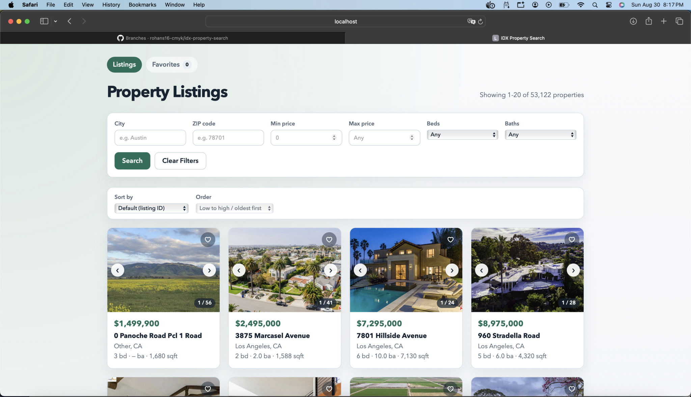

# IDX Property Search

A full-stack MLS property search application built during the IDX Exchange SDE internship. Browse ~53k listings from `rets_property`, filter and sort results, paginate through matches, view property details with photos and maps, save favorites locally, and inspect open house schedules from `rets_openhouse`.



## Tech stack

| Layer | Technology | Version |
|-------|------------|---------|
| Frontend | React (Create React App) | 18.3.x |
| Routing | React Router | 6.30.x |
| Backend | Node.js + Express | 4.22.x |
| Database | MySQL 8 (Docker) | 8.x |
| DB driver | mysql2 (connection pool) | 3.22.x |
| Testing (frontend) | Jest + React Testing Library | via react-scripts 5 |
| Testing (backend routes) | Jest + Supertest (mocked pool) | Jest 30.x |
| Testing (backend integration) | Node.js built-in test runner | optional, needs live DB |

## Architecture

```
Browser (localhost:3000)
    │  fetch /api/*
    ▼
Express API (localhost:5001)
    │  mysql2 pool
    ▼
MySQL Docker (idx-mysql-local:3306)
    ├── rets_property   (~53k rows)
    └── rets_openhouse  (~4k rows)
```

**Separation of concerns**

- `frontend/src/api/` — HTTP client; React never touches MySQL
- `frontend/src/pages/` — route-level screens
- `frontend/src/components/` — reusable UI
- `frontend/src/hooks/` — favorites state (`localStorage`)
- `backend/routes/` — REST handlers
- `backend/utils/propertyQuery.js` — query param validation + SQL `WHERE`/`ORDER BY` building

## Local setup (fresh machine)

### Prerequisites

- Node.js 18+ and npm
- Docker Desktop (for MySQL)
- Git

### 1. Clone and install dependencies

```bash
git clone https://github.com/rohans16-cmyk/idx-property-search.git
cd idx-property-search

cd backend && npm install
cd ../frontend && npm install
```

### 2. Start MySQL in Docker

```bash
docker run -d \
  --name idx-mysql-local \
  -e MYSQL_ROOT_PASSWORD=rootpassword \
  -e MYSQL_DATABASE=rets \
  -p 3306:3306 \
  mysql:8
```

If the container already exists: `docker start idx-mysql-local`

### 3. Load schema and data

From the repo root:

```bash
docker exec -i idx-mysql-local mysql -uroot -prootpassword rets < sql/rets_property.sql
docker exec -i idx-mysql-local mysql -uroot -prootpassword rets < sql/rets_openhouse.sql
docker exec -i idx-mysql-local mysql -uroot -prootpassword rets < sql/add_property_indexes.sql

# Optional performance indexes (Week 9)
docker exec -i idx-mysql-local mysql -uroot -prootpassword rets < sql/week9_composite_indexes.sql
```

Verify:

```bash
docker exec -it idx-mysql-local mysql -uroot -prootpassword rets -e "SELECT COUNT(*) FROM rets_property;"
```

Expect ~53,000 rows.

### 4. Configure the backend

Create `backend/.env` (not committed):

```env
DB_HOST=127.0.0.1
DB_PORT=3306
DB_USER=root
DB_PASSWORD=rootpassword
DB_NAME=rets
PORT=5001
```

Port **5001** avoids macOS AirPlay Receiver on port 5000. The React dev proxy targets 5001.

### 5. Run the app

**Terminal 1 — API**

```bash
cd backend
npm run dev
```

**Terminal 2 — React**

```bash
cd frontend
npm start
```

Open **http://localhost:3000**

### 6. Run tests

From the repo root:

```bash
npm test
```

Or separately:

```bash
cd backend && npm run test:unit      # Jest + Supertest, mocked DB (no Docker needed)
cd backend && npm run test:integration  # optional live-DB checks
cd frontend && CI=true npm test -- --watchAll=false --coverage \
  --collectCoverageFrom='src/components/**/*.{js,jsx}' \
  --collectCoverageFrom='!src/**/*.test.js'
```

## API reference

Base URL (local): `http://localhost:5001`

### `GET /api/health`

Checks database connectivity.

**Response 200**

```json
{ "status": "ok", "database": "connected" }
```

**Response 500** (MySQL down)

```json
{
  "status": "error",
  "database": "disconnected",
  "message": "Database connection failed"
}
```

---

### `GET /api/properties`

Search listings with filters, pagination, and sorting.

**Query parameters**

| Param | Type | Description |
|-------|------|-------------|
| `city` | string | Case-insensitive city match (`LOWER(TRIM(L_City))`) |
| `zipcode` | string | Exact ZIP (`TRIM(L_Zip)`) |
| `minPrice` / `maxPrice` | number | Price range on `L_SystemPrice` |
| `beds` / `baths` | integer | Exact bedroom/bathroom count |
| `minBeds` / `minBaths` | integer | Minimum beds/baths (use `6+` in UI) |
| `limit` | integer | Page size (default 20, max 100) |
| `offset` | integer | Rows to skip (default 0) |
| `sortBy` | string | `L_SystemPrice`, `ListingContractDate`, `LM_Int2_3`, `L_Keyword2` |
| `sortOrder` | string | `ASC` or `DESC` |

**Example**

```bash
curl "http://localhost:5001/api/properties?city=Portland&minPrice=300000&beds=3&limit=5&sortBy=L_SystemPrice&sortOrder=DESC"
```

**Response 200**

```json
{
  "total": 142,
  "limit": 5,
  "offset": 0,
  "sortBy": "L_SystemPrice",
  "sortOrder": "DESC",
  "results": [
    {
      "L_ListingID": "1174572339",
      "L_Address": "123 Main St",
      "L_City": "Portland",
      "L_State": "OR",
      "L_SystemPrice": 450000,
      "L_Keyword2": "3",
      "LM_Dec_3": "2",
      "LM_Int2_3": 1800,
      "L_Photos": "[\"https://example.com/photo.jpg\"]"
    }
  ]
}
```

**Response 400** — invalid `limit`, bad numeric filter, unknown `sortBy`, etc.

---

### `GET /api/properties/:id`

Full property row from `rets_property`.

**Example**

```bash
curl "http://localhost:5001/api/properties/1174572339"
```

**Response 200** — single property object (all columns).

**Response 404** — unknown listing ID.

**Response 400** — malformed ID (slashes, too long, invalid characters).

---

### `GET /api/properties/:id/openhouses`

Open houses for a listing, ordered by date and start time.

> **Route order matters:** this path is registered **before** `/:id` in Express so `1174572339/openhouses` is not captured as an ID.

**Example**

```bash
curl "http://localhost:5001/api/properties/1174572339/openhouses"
```

**Response 200** — array (may be empty if the property exists but has no open houses).

**Response 404** — property not found.

## Database schema summary

### `rets_property`

Primary listing table (~53k rows). Key columns:

| Column | Purpose |
|--------|---------|
| `L_ListingID` | Primary lookup key |
| `L_Address`, `L_City`, `L_State`, `L_Zip` | Location |
| `L_SystemPrice` | List price |
| `L_Keyword2` | Bedrooms (stored as text) |
| `LM_Dec_3` | Bathrooms |
| `LM_Int2_3` | Square footage |
| `L_Photos` | JSON string of image URLs (often malformed) |
| `LMD_MP_Latitude`, `LMD_MP_Longitude` | Map coordinates (sometimes missing) |
| `L_Remarks` | Description |
| `ListingContractDate` | Date listed (sortable) |

### `rets_openhouse`

Open house events linked by `L_ListingID` → `rets_property.L_ListingID`.

| Column | Purpose |
|--------|---------|
| `OpenHouseDate`, `OH_StartTime`, `OH_EndTime` | Schedule |
| `all_data` | JSON blob; `OpenHouseRemarks` must be extracted in the frontend |

## Features

- **Search & filter** — city, ZIP, price range, beds/baths
- **Pagination** — server-side `limit`/`offset` with stable sort tie-break on `L_ListingID`
- **Sorting** — whitelisted MLS column names only (wrong names return 400)
- **Property detail** — gallery/lightbox, map, remarks, open houses
- **Favorites** — `localStorage` persistence, dedicated `/favorites` page
- **Defensive parsing** — photos, null prices, missing coordinates

## Known issues & future improvements

| Issue | Handling today | Future |
|-------|----------------|--------|
| `L_Photos` not always valid JSON | `parsePhotoUrls()` try/catch + placeholder | CDN-backed image service |
| Inconsistent city casing | `LOWER(TRIM())` in SQL | Normalized city dimension table |
| Missing lat/lon | Map hidden when coords invalid | Geocode on ingest |
| Sold listing image URLs expire | Documented; refresh tables before demo | Scheduled URL refresh job |
| No authentication | Favorites are per-browser only | User accounts + server-side saves |
| Single-region dataset | N/A | Multi-MLS federation |

## Project structure

```
idx-property-search/
├── backend/
│   ├── routes/          # Express routers (health, properties)
│   ├── utils/           # Query building, ID validation
│   ├── tests/           # Jest route tests + optional integration tests
│   └── server.js
├── frontend/
│   └── src/
│       ├── api/         # fetch wrappers
│       ├── components/  # UI building blocks
│       ├── hooks/       # useFavorites
│       ├── pages/       # Listings, Detail, Favorites
│       └── utils/       # format, photos, coords
├── sql/                 # Schema, seed data, indexes
└── WEEK*-NOTES.md       # Weekly checkpoint notes
```

## Weekly progress

| Week | Topic |
|------|-------|
| 1–2 | Docker MySQL + Express API |
| 3–4 | Property search API + detail/open houses |
| 5–7 | React listings, filters, pagination, tests |
| 8 | Property detail page end-to-end |
| 9 | Sorting + favorites + performance (EXPLAIN, indexes) |
| 10 | Git workflow (`develop`, feature branches, lint) |
| 11 | Comprehensive testing + this README |
| 12 | Final demo & presentation |

## License

Internal IDX Exchange internship project.
